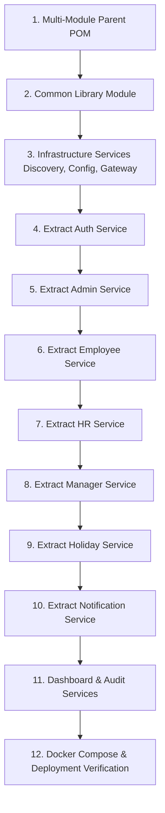

# Enterprise Microservices Migration Plan & Phase 1 Analysis Report

## Executive Summary
This document presents the complete architectural analysis (Phase 1) and step-by-step implementation plan (Phase 2) to decompose the existing **MultiTenantCrm Monolith** (`tenantCrm`) into a production-ready, scalable, event-driven Spring Cloud Multi-Module Microservices platform.

---

# Phase 1: Complete Project Analysis Report

### 1. Current Architecture Overview
- **Framework & Runtime**: Java 17, Spring Boot `3.5.0`, Spring Security 6, Spring Data JPA, Hibernate, Thymeleaf template engine.
- **Database Architecture**: Single monolithic MySQL database (`crm`) with `spring.jpa.hibernate.ddl-auto=update`. Cross-entity relationships use direct JPA foreign key annotations (`@ManyToOne`, `@ManyToMany`).
- **Security & Session Strategy**: Custom JWT implementation using `jjwt-api` 0.12.6, stateless sessions, cookie-based token propagation, Spring Security Filter Chain (`JwtAuthFilter`).
- **Real-Time Communication**: Spring WebSocket with SockJS and STOMP for notification delivery.
- **Document Processing**: Apache POI (`poi-ooxml`) for bulk employee data imports.

---

### 2. Identified Business Modules
| Monolith Component | Key Classes & Controllers | Database Tables Managed | Domain Responsibility |
| :--- | :--- | :--- | :--- |
| **Authentication & Password** | `LoginController`, `PasswordController`, `JwtUtil`, `JwtAuthFilter`, `SessionManager` | `users`, `password_reset_token` | User login, token generation, password resets, session/cookie handling. |
| **Super Admin & Admin** | `SuperAdminController`, `AdminController` | `users`, `domain_category`, `teams`, `projects` | Tenant provisioning, domain categories, admin creation, global team/project management. |
| **Employee Portal** | `EmployeeController` | `tasks`, `task_attachment`, `attendance`, `leave_requests` | Personal dashboard, self-attendance, leave submission, assigned task management. |
| **HR Operations** | `HrController` | `users`, `leave_requests`, `attendance`, `payroll_template`, `payslip` | Employee onboarding, attendance tracking, leave approval, payroll configuration & payslip generation. |
| **Manager Workflows** | `ManagerController` | `teams`, `tasks`, `reports`, `report_attachment`, `meetings`, `performance_review` | Team management, task allocation, team leave approval, performance reviews, team meetings. |
| **Holidays** | `HolidayController`, `HolidayService` | `holidays` | Company-wide holiday calendar CRUD. |
| **Notifications** | `NotificationController`, `NotificationService` | `notifications` | In-app alerts, JavaMailSender SMTP email delivery, STOMP WebSockets. |

---

### 3. Shared Components & Cross-Module Dependencies
- **`BaseController`**: Central abstract base class inherited by `AdminController`, `EmployeeController`, `HrController`, and `ManagerController`. Contains status constants (`STATUS_APPROVED`, `PRIORITY_HIGH`), user context resolution (`getCurrentUser()`), and domain segment parsing.
- **Monolithic Entity Coupling**: `User` entity is directly referenced across almost all models (`Task`, `Report`, `Meeting`, `LeaveRequest`, `Attendance`, `Payslip`, `PerformanceReview`, `Notification`).
- **Direct Database Joins**: Cross-entity relationships prevent easy module isolation in a traditional monolith without API abstraction.

---

### 4. Technical Debt & Bottlenecks
1. **Fat Controllers**: Business logic is heavily embedded directly in controllers (`HrController` ~91KB, `ManagerController` ~85KB, `AdminController` ~46KB).
2. **Synchronous Email Dispatch**: `NotificationService` sends emails synchronously over SMTP on the HTTP request thread.
3. **No Explicit DTO Layer**: Controllers frequently accept and expose JPA `@Entity` instances directly.
4. **Hardcoded Fallbacks**: Security and JWT properties fallback to static strings in source code if environment variables are unset.

---

### 5. Recommended Microservice Boundaries & Port Allocations
```
                       +-------------------------+
                       |    Spring Cloud Gateway  |  (Port: 8080)
                       +------------+------------+
                                    |
          +-------------------------+-------------------------+
          |                         |                         |
+---------v--------+      +---------v--------+      +---------v--------+
|  Auth Service    |      |  Admin Service   |      | Employee Service |
|   (Port: 8081)   |      |   (Port: 8082)   |      |   (Port: 8083)   |
+------------------+      +------------------+      +------------------+
          |                         |                         |
+---------v--------+      +---------v--------+      +---------v--------+
|  Manager Service |      |    HR Service    |      | Holiday Service  |
|   (Port: 8084)   |      |   (Port: 8085)   |      |   (Port: 8086)   |
+------------------+      +------------------+      +------------------+
          |                         |                         |
+---------v--------+      +---------v--------+      +---------v--------+
| Notification Svc |      | Dashboard Svc    |      | Audit Service    |
|   (Port: 8087)   |      |   (Port: 8088)   |      |   (Port: 8089)   |
+------------------+      +------------------+      +------------------+
```
- **Service Discovery**: Netflix Eureka Server (`discovery-server`, Port: 8761)
- **Centralized Config**: Spring Cloud Config Server (`config-server`, Port: 8888)
- **Shared Library**: `common-library` (JAR dependency for all services)

---

# Phase 2: Target Architecture & Step-by-Step Migration Plan

## User Review Required

> [!IMPORTANT]
> **Zero Functionality & UI Loss Guarantee**: The existing UI templates (`templates/*.html`) and static assets (`static/*`) will be preserved. Controllers will remain compatible while routing through OpenFeign and API Gateway endpoints.

> [!NOTE]
> **Database Strategy**: Services will initially share the MySQL schema while JPA relationships between domains are refactored to use User ID references (`Long userId`) and Feign client lookups instead of `@ManyToOne User`.

---

## Proposed Changes

### Parent POM & Multi-Module Structure

#### [NEW] [pom.xml](file:///c:/Users/Lenovo/git/MultiTenantCrm/pom.xml)
Parent Maven POM managing spring-boot-dependencies `3.5.0`, spring-cloud-dependencies `2024.0.0`, submodules, compile plugins, and shared version properties.

---

### Shared Common Library

#### [NEW] [common-library](file:///c:/Users/Lenovo/git/MultiTenantCrm/common-library)
Contains:
- Shared DTOs (`UserDTO`, `AttendanceDTO`, `LeaveRequestDTO`, `TaskDTO`, `PayslipDTO`, `NotificationDTO`)
- Shared Enums (`Role`, `TaskStatus`, `LeaveStatus`, `AttendanceStatus`, `Priority`)
- Shared Constants & Custom Exceptions (`ResourceNotFoundException`, `UnauthorizedException`, `BaseConstants`)
- JWT Utilities & Response Wrappers (`ApiResponse<T>`)

---

### Infrastructure Services

#### [NEW] [discovery-server](file:///c:/Users/Lenovo/git/MultiTenantCrm/discovery-server)
Eureka Server for dynamic service registration.

#### [NEW] [config-server](file:///c:/Users/Lenovo/git/MultiTenantCrm/config-server)
Spring Cloud Config Server managing Git / Native YAML profiles for all microservices.

#### [NEW] [gateway-service](file:///c:/Users/Lenovo/git/MultiTenantCrm/gateway-service)
Spring Cloud API Gateway handling unified entry point, CORS, rate limiting, and JWT authentication routing.

---

### Core Business Microservices

#### [NEW] [auth-service](file:///c:/Users/Lenovo/git/MultiTenantCrm/auth-service)
Extracted `LoginController`, `PasswordController`, `JwtUtil`, `SecurityConfig`, user credentials validation, and token issue/refresh endpoints.

#### [NEW] [admin-service](file:///c:/Users/Lenovo/git/MultiTenantCrm/admin-service)
Extracted `SuperAdminController`, `AdminController`, team & domain management services and repositories.

#### [NEW] [employee-service](file:///c:/Users/Lenovo/git/MultiTenantCrm/employee-service)
Extracted `EmployeeController`, personal task management, employee portal logic, personal attendance, personal leaves.

#### [NEW] [hr-service](file:///c:/Users/Lenovo/git/MultiTenantCrm/hr-service)
Extracted `HrController`, employee onboarding, leave approval workflow, payroll templates, and monthly payslip generation.

#### [NEW] [manager-service](file:///c:/Users/Lenovo/git/MultiTenantCrm/manager-service)
Extracted `ManagerController`, team task assignment, team leave approvals, performance reviews, team meetings.

#### [NEW] [holiday-service](file:///c:/Users/Lenovo/git/MultiTenantCrm/holiday-service)
Extracted `HolidayController`, `HolidayService`, `HolidayRepository`.

#### [NEW] [notification-service](file:///c:/Users/Lenovo/git/MultiTenantCrm/notification-service)
Extracted `NotificationController`, `NotificationService`, Kafka event consumer, SMTP email dispatcher, and WebSocket server.

#### [NEW] [dashboard-service](file:///c:/Users/Lenovo/git/MultiTenantCrm/dashboard-service)
Analytics aggregation service for system metrics, employee count, leave statistics, and admin dashboards.

#### [NEW] [audit-service](file:///c:/Users/Lenovo/git/MultiTenantCrm/audit-service)
Centralized event listener logging audit events across all CRM services.

---

### Infrastructure & Deployment

#### [NEW] [deployment](file:///c:/Users/Lenovo/git/MultiTenantCrm/deployment)
`docker-compose.yml`, Dockerfiles for each microservice, and Kubernetes manifest templates.

---

## Migration Workflow Steps



---

## Verification Plan

### Automated Tests & Builds
- Run clean Maven compilation on each module:
  `mvn clean compile`
- Run Jacoco and JUnit 5 unit test suites across all modules:
  `mvn test`
- Build container images via Docker:
  `docker compose build`

### Manual & Integration Verification
- Verify Eureka Service Registry dashboard at `http://localhost:8761`.
- Verify API Gateway routing through `http://localhost:8080/api/...`.
- Verify authentication, login flow, JWT validation, and token extraction.
- Verify end-to-end functionality across all microservices.
